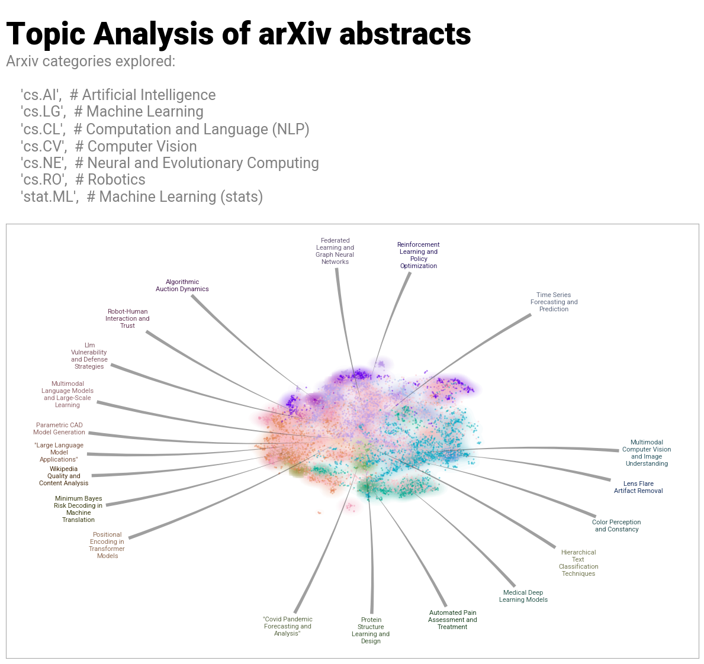

# Topic Modeling of arXiv cs.AI Abstracts

Unsupervised topic discovery of 266,758 research abstracts from Artificial Intelligence related categories on arXiv using BERTopic and a large language model.

## Overview

This project applies modern topic modeling techniques to understand research trends in AI:
- **BERTopic clustering** with sentence-transformer embeddings
- **LLM-generated topic labels** using llama3 for interpretable results
- **Interactive visualizations** with DataMapPlot and Plotly

## Key Results

### Topic Landscape
High-dimensional embeddings reduced to 2D using UMAP, revealing distinct research clusters:



## Building the Report

Compile the full technical report:
```bash
make
```

Output: `doc/paper/abstract_topic_modeling.pdf`

